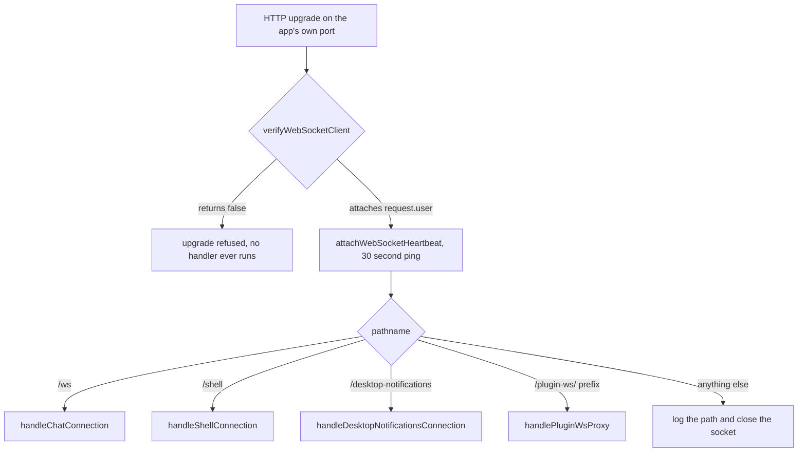
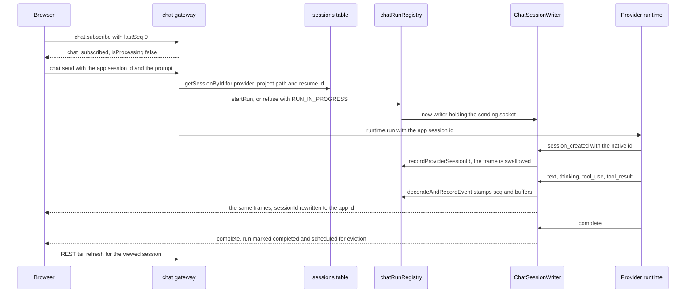
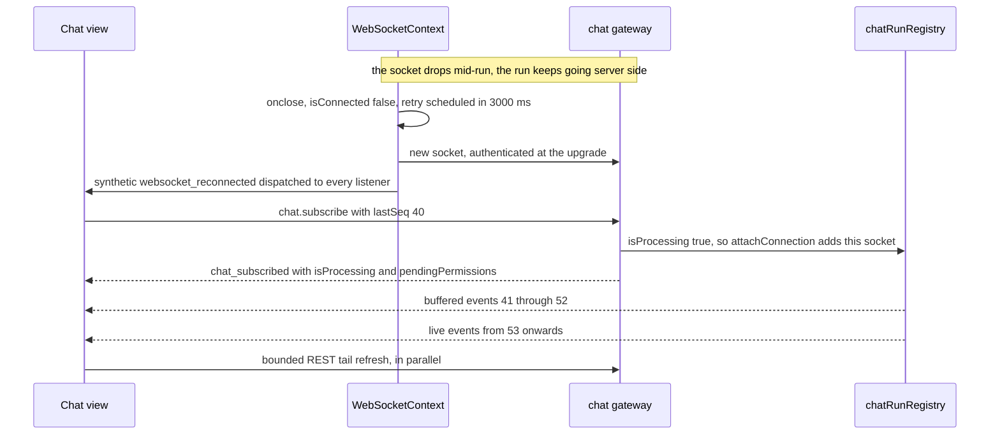
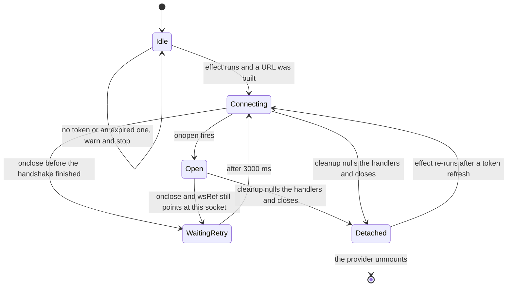
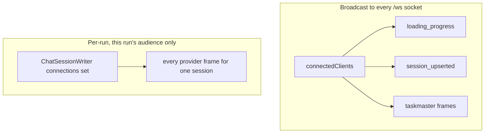

# The websocket transport

*One websocket server, four paths, and the small protocol that runs over the chat one.
Covers routing, auth, the frame vocabulary in both directions, and how a client catches up
after a drop. What the frames turn into on screen is
[the realtime stream](./02-realtime-stream.md); which ids they carry is
[conversation handoff](./03-conversation-handoff.md).*

## In one paragraph

There is exactly **one** `WebSocketServer`. It is attached to the same HTTP server that
serves the app, and it decides what a connection is by looking at the pathname — there is
no second server and no socket.io-style namespacing. Every path authenticates once, at the
HTTP upgrade, before any handler runs. The path that matters is `/ws`, the chat socket: a
browser tab opens exactly one, and every feature that needs live data subscribes to that
one socket rather than opening its own. The protocol on it is deliberately small — six
inbound message types, every outbound frame tagged with a `kind` — so the client needs one
switch statement and no provider-specific branching. The server trusts the client for the
session id and the prompt text and nothing else: provider, project path and the
provider-native session id are all read out of the database from that session id. And a
*run* is owned by the server, not by the socket that started it, which is what makes a
mid-answer page refresh, a second tab, and a scheduled message with no browser attached all
work the same way.

## Mental model

Nine rules. If you can predict what these say about a change, you can predict what the code
does.

1. **One server, one socket per tab, four paths.** `/ws` (chat), `/shell` (terminals),
   `/desktop-notifications` (the Electron main process), `/plugin-ws/:name` (a passthrough
   proxy). Routing is a pathname comparison in one `connection` handler.
2. **Authentication happens at the upgrade, once, for every path.** If a handler is
   running, the connection is authenticated. No handler re-checks a token, and no frame
   carries credentials.
3. **`kind` goes down, `type` goes up.** Every server-to-client chat frame is discriminated
   by `kind`; every client-to-server message is discriminated by `type`. Task Master's
   broadcasts are the single exception — they travel down the same socket keyed by `type`.
4. **The client is trusted for the session id and the prompt. Nothing else.** Provider,
   working directory and the provider-native resume id come from the `sessions` row.
   Attachment paths are re-validated against the upload store before any runtime sees them.
5. **A run belongs to the server, not to a socket.** It can start with no audience, it
   keeps running when every viewer disconnects, and it can have several viewers at once.
   Closing a tab detaches a listener; it does not cancel anything.
6. **Every live frame gets a per-run `seq` and is buffered.** Catching up is always the
   same move: send `chat.subscribe` with the highest `seq` you saw, get an authoritative
   ack, then get exactly the frames you missed.
7. **Exactly one `complete` ends a run — and `error` is not it.** Providers emit `error`
   for mid-run problems and keep going. Only `complete` clears processing state.
8. **Completed runs are never replayed.** Once a run has finished, its transcript belongs
   to REST. Replaying it would duplicate what the history fetch already returned.
9. **There is no send queue and no backoff.** A frame sent while the socket is closed is
   logged and dropped; a dropped socket retries flat every 3 seconds, forever.

A tenth thing that is not a rule but is worth holding: there are exactly **two fan-out
mechanisms**, and confusing them is the most common bug in this area. `connectedClients` is
every open `/ws` socket in the process. A run's writer holds only the sockets watching
*that* run.

## The pieces

| File | Role |
| --- | --- |
| `server/modules/websocket/services/websocket-server.service.ts` | Creates the one `WebSocketServer`, attaches the heartbeat, routes by pathname |
| `server/modules/websocket/services/websocket-auth.service.ts` | `verifyWebSocketClient` — the upgrade-time gate for every path |
| `server/modules/auth/auth.middleware.ts` | `authenticateWebSocket` — first DB user in platform mode, JWT verification in OSS mode |
| `server/modules/websocket/services/websocket-state.service.ts` | `connectedClients`, the set of open `/ws` sockets, and `WS_OPEN_STATE` |
| `server/modules/websocket/services/chat-websocket.service.ts` | The `/ws` protocol: the six inbound handlers, `protocol_error`, the attachment trust boundary, `runDetachedChatTurn` |
| `server/modules/websocket/services/chat-run-registry.service.ts` | `chatRunRegistry` — one run per session, `seq` stamping, the replay buffer, the exactly-one-`complete` contract |
| `server/modules/websocket/services/chat-session-writer.service.ts` | `ChatSessionWriter` — the object runtimes write into; swallows `session_created`, fans out to every attached socket |
| `server/modules/websocket/services/session-upsert-broadcast.service.ts` | The only builder of `session_upserted`, and the batched broadcast helper |
| `server/modules/projects/services/projects-with-sessions-fetch.service.ts` | `broadcastProgress` — the `loading_progress` frames |
| `server/modules/taskmaster/taskmaster.routes.ts` | `broadcastTaskMasterUpdate` — the `type`-keyed exception |
| `server/modules/websocket/services/shell-websocket.service.ts` | The `/shell` protocol, the PTY registry, output buffering and reattachment |
| `server/modules/websocket/services/plugin-websocket-proxy.service.ts` | `/plugin-ws/:name` passthrough to a plugin's own websocket |
| `server/modules/notifications/websocket/desktop-notifications-websocket.service.ts` | `/desktop-notifications` registration protocol |
| `server/shared/types.ts` | `MessageKind`, `GatewayEventKind`, `ServerEventKind`, `NormalizedMessage.seq` |
| `src/shared/context/WebSocketContext.tsx` | The single browser-side socket: URL building, reconnect, the `subscribe` fan-out |
| `src/modules/chat/hooks/useChatRealtimeHandlers.ts` | The one `kind` switch on the client, and `lastSeqRef` bookkeeping |
| `src/modules/chat/ChatInterface.tsx`, `src/modules/chat/hooks/useChatSessionState.ts` | The two places that send `chat.subscribe` |
| `src/modules/chat/hooks/useChatComposerState.ts` | Builds `chat.send`, `chat.edit-send`, `chat.abort`, `chat.permission-response` |

## Routing: pathname, not namespace

**RULE: one `connection` handler compares `new URL(...).pathname` and hands the socket to
exactly one owner. Everything before that comparison — auth, heartbeat — is shared.**

`createWebSocketServer` (`websocket-server.service.ts:83`) builds the server over the
existing HTTP server (`:87`) and passes `verifyWebSocketClient` as `verifyClient`
(`:89-91`). The `connection` handler attaches the heartbeat *first* (`:95`), then routes:
`/shell` (`:101`), `/ws` (`:106`) and `/desktop-notifications` (`:111`) are exact matches,
`/plugin-ws/` is the one prefix match (`:116`), and anything else is logged and closed
(`:121-122`).

Two things that are easy to assume and wrong:

- **`/plugin-ws` has no in-repo client.** The route exists for plugin-authored frontend
  code. Nothing under `src/` opens it.
- **The `/desktop-notifications` client is the Electron *main* process**, not a renderer.
  It uses the Node `ws` package and authenticates with an `Authorization` header
  (`electron/desktopNotifications.js:202`, headers built at `:280-290`) — something a
  browser `WebSocket` cannot do, which is the whole reason the browser paths use a query
  parameter instead.

## Authentication at the upgrade

**RULE: `verifyClient` runs before the `connection` event, so an unauthenticated socket
never reaches a route handler. Failure is an upgrade rejection, not a close frame.**

`verifyWebSocketClient` (`websocket-auth.service.ts:18`) logs the attempt with the token
redacted (`:25-29`, added by `14ddbc7c`) and then splits:

| Mode | What it does |
| --- | --- |
| Platform (`isPlatform`) | Calls `authenticateWebSocket(null)`, which returns the first user in the database, and **ignores tokens entirely** (`:32-42`) |
| OSS | Takes the JWT from the `token` query parameter, falling back to `Authorization: Bearer` (`:45-48`), and verifies it plus the user row (`auth.middleware.ts:118-155`) |

On success the user is attached as `request.user` and the upgrade proceeds; on failure the
function returns `false` and the client sees a failed handshake.

The two modes return *different user shapes* — platform returns `{ id, userId, username }`,
OSS returns `{ userId, username }` with no `id` — which is why the chat handler reads the
id through `readRequestUserId` (`chat-websocket.service.ts:89-106`) instead of touching
`user.id` directly.

Only `/ws` and `/desktop-notifications` read `request.user` at all. `/shell` and
`/plugin-ws` just needed the connection to be authenticated.

## The client's single socket

**RULE: `WebSocketProvider` is mounted once by `App` and owns the only chat socket. Features
call `subscribe(listener)`; they never construct a `WebSocket`.**

`buildWebSocketUrl` (`WebSocketContext.tsx:36-45`) is the whole URL story: same host as the
page, `wss:` when the page is `https:`, `/ws` with no token in platform mode, `/ws?token=`
in OSS mode. An expired token is caught here — `expireAuthSession()` runs and the function
returns `null`, so no socket is created at all.

**The listener registry is a ref-held `Set`, dispatched synchronously** (`:56`, `:61-69`),
not React state. The declaration says why:

> events are dispatched synchronously to every listener, so rapid back-to-back frames
> cannot be coalesced or dropped. Frames are deliberately not copied into React state; each
> listener updates only the state owned by the feature that handles it.
> — `WebSocketContext.tsx:16-20`

Put frames in state instead and two frames arriving in the same tick collapse into one
render carrying only the later one. A listener that throws is caught individually
(`:63-67`) so it cannot take the others down with it.

There are exactly three `useWebSocket()` call sites, and two of them immediately hand
`subscribe` to the hook that does the real work:

| Call site | Handler | Frames it acts on | State it owns |
| --- | --- | --- | --- |
| `ChatInterface.tsx:72` | `useChatRealtimeHandlers` | every provider `kind`, `chat_subscribed`, `history_truncated`, `protocol_error`, `websocket_reconnected` | session store, processing state, pending permissions, token budget |
| `ProjectWorkspaceRoute.tsx:32` | `useProjectsState` | `session_upserted`, `loading_progress`, `websocket_reconnected`, plus a sessionId-keyed "attention" marker for background sessions | project list, sidebar rows, session aliasing, selection |
| `TaskMasterContext.tsx:102` | itself | `taskmaster-project-updated`, `taskmaster-tasks-updated` (`type`-keyed) | task board data |

Ownership is deliberately disjoint: the chat handler returns early on `session_upserted` and
`loading_progress` (`useChatRealtimeHandlers.ts:175-178`), and returns immediately on any
frame with no `kind` at all (`:96-98`), which is how the Task Master frames pass it by.

## The chat protocol going up

**RULE: six `type` values, dispatched by one switch (`chat-websocket.service.ts:676-698`).
Anything else is answered with `protocol_error` / `UNKNOWN_MESSAGE_TYPE`; anything that
throws is answered with `INTERNAL_ERROR`.**

| `type` | Payload | What the server does |
| --- | --- | --- |
| `chat.send` | `sessionId`, `content`, `options` | Resolves the session row, registers the run, dispatches to the provider runtime (`:146-158`). On a session whose previous turn left background work running, the new turn's CLI process supersedes the one that work runs under, so the work is stopped or finishes unheard; the composer asks the user before sending such a turn |
| `chat.edit-send` | as above plus `anchorId` | Announces `history_truncated`, rewinds or resumes the provider transcript at the anchor, then dispatches (`:314-408`) |
| `chat.abort` | `sessionId` | Aborts the runtime and emits the terminal `complete` on its behalf (`:415-438`) |
| `chat.stop-task` | `sessionId`, `taskId` | Stops one background task (agent, workflow or backgrounded command) through the provider runtime; the runtime reports the stop on the session's stream |
| `chat.subscribe` | `sessions: [{ sessionId, lastSeq }]` | Acks with `chat_subscribed`, attaches this socket to a running run — or to a completed one whose session still has background work — and replays what was missed for running runs (`:448-504`) |
| `chat.permission-response` | `requestId`, `allow`, `updatedInput?`, `message?`, `rememberEntry?` | Resolves one pending tool approval (`:511-522`) |

All six are built in exactly three client files: the composer builds sends, aborts and
permission answers (`useChatComposerState.ts:825-837`, `:1121-1124`, `:1149-1156`),
`chat.stop-task` is built by the background-tasks strip's ✕ (`BackgroundTasksStrip.tsx`), and
`chat.subscribe` is built in `useChatSessionState.ts:668-674` and
`ChatInterface.tsx:267-273`.

### The client is not trusted past the session id

`resolveSendTarget` (`:170-200`) is the shared front half of `chat.send` and
`chat.edit-send`. It reads the row from `sessionsDb` and takes provider, project path and
provider-native id from there:

> the session row and provider come from the database, never from the client.
> — `chat-websocket.service.ts:167-168`

A send for a session with no row is refused with `SESSION_NOT_FOUND` and told to create it
over REST first (`:184-189`) — that is the entry point in
[conversation handoff](./03-conversation-handoff.md).

Attachments get the same treatment. `filterAttachmentsToUploadStore` (`:34-56`) resolves
every path against the global upload store (`~/.cloudcli/assets`, where
`POST /api/assets/images` writes) and keeps it only if it is a **direct child** of that
directory: relative paths are anchored there, absolute paths must already be inside it, and
traversal or subdirectories are dropped with a warning. Survivors are deduped by path and
re-split into `attachments` / `images` / `files` before the runtime sees them (`:253-276`).
The rejected shapes are covered by `tests/chat-attachment-filter.test.ts`.

### Protocol errors have their own kind

`sendProtocolError` (`:121-134`) emits `kind: 'protocol_error'` rather than a provider
`error`, and the reason is worth keeping:

> so the frontend can distinguish "your request was invalid" from "the model run produced
> an error" without inspecting text.
> — `chat-websocket.service.ts:117-119`

Every code that exists, with the line that emits it:

| Code | Line | Meaning |
| --- | --- | --- |
| `SESSION_ID_REQUIRED` | `:178`, `:422` | The frame carried no usable `sessionId` |
| `SESSION_NOT_FOUND` | `:186` | No row in `sessions` — create it over REST first |
| `UNSUPPORTED_PROVIDER` | `:195` | The session's provider has no registered runtime |
| `RUN_IN_PROGRESS` | `:232` | `startRun` refused: this session already has a running run |
| `ANCHOR_REQUIRED` | `:328` | `chat.edit-send` without an `anchorId` |
| `EDIT_NOT_SUPPORTED` | `:338` | The provider cannot re-run from a point |
| `ANCHOR_NOT_FOUND` | `:345` | The anchor is no longer in the transcript |
| `ANCHOR_LOOKUP_FAILED` | `:351` | Reading the transcript threw |
| `EDIT_REWIND_FAILED` | `:400` | The rewind itself failed; the run is ended too |
| `NO_ACTIVE_RUN` | `:428` | `chat.abort` for a session with nothing running |
| `TASK_ID_REQUIRED` | | `chat.stop-task` without a task id |
| `NO_SUCH_TASK` | | `chat.stop-task` for a task the runtime is not tracking (already settled, or never this session's) |
| `UNKNOWN_MESSAGE_TYPE` | `:620` | Unrecognised `type` |
| `INTERNAL_ERROR` | `:626` | Anything thrown out of a handler |

On the client, `protocol_error` both surfaces an error row and clears the spinner
(`useChatRealtimeHandlers.ts:157-173`) — correct precisely because no `complete` will
follow a request that never became a run.

**Two inbound frames fail silently by design.** `chat.permission-response` returns without
an answer when `requestId` is missing or empty (`:512-514`), and `chat.subscribe` with no
`sessions` array does nothing at all (`:453`) — no ack, no error.

## The chat protocol coming down

**RULE: every frame the chat gateway sends carries a `kind`, drawn from one of two unions
in `server/shared/types.ts`.**

**`MessageKind` (`:178-193`) — produced by provider runtimes:** `text`, `tool_use`,
`tool_result`, `thinking`, `stream_delta`, `stream_end`, `error`, `complete`, `status`,
`permission_request`, `permission_resolved`, `permission_cancelled`, `session_created`,
`history_truncated`, `task_notification`, `subagent_update`.

**`GatewayEventKind` (`:204-208`) — produced by the gateway, no provider involved:**
`chat_subscribed`, `session_upserted`, `loading_progress`, `protocol_error`.

`ServerEventKind` (`:217`) is their union, and its doc comment claims every server-to-client
frame carries a `kind` from it. That is true of everything the *chat gateway* sends and not
quite true of the socket as a whole — see the Task Master exception below.

Two kinds in those unions never appear where you would look for them:

- **`session_created` never reaches a browser.** `ChatSessionWriter` intercepts it, records
  the provider-native id and returns before the frame is ever sequenced
  (`chat-session-writer.service.ts:98-109`).
- **`websocket_reconnected` is never sent by the server.** It is injected client-side when
  the socket re-opens (`WebSocketContext.tsx:89-92`) and is documented as synthetic in
  `src/shared/types.ts:197-203`.

| Kind | Origin | Consumed by |
| --- | --- | --- |
| `text`, `thinking`, `tool_use`, `tool_result`, `task_notification`, `subagent_update` | Provider runtime | `useChatRealtimeHandlers` → session store (`:224-233`) |
| `stream_delta`, `stream_end` | Provider runtime | `useChatRealtimeHandlers`, flushed on a 100 ms timer (`:189-221`) |
| `status` | Provider runtime | Activity indicator; `text === 'token_budget'` updates the context counter, and only for the viewed session (`:329-343`) |
| `error` | Provider runtime | A message row. **Not** terminal |
| `complete` | Runtime, or synthesised by the registry | Terminal: clears processing state and triggers a REST tail refresh (`:237-279`) |
| `permission_request`, `permission_resolved`, `permission_cancelled` | Provider runtime | The permission banner and its pending list (`:285-328`) |
| `history_truncated` | `chat-websocket.service.ts:388-393` | `sessionStore.truncateAt` (`:116-124`) |
| `chat_subscribed` | `chat-websocket.service.ts:485-492` | Authoritative processing state plus pending permissions (`:126-155`) |
| `protocol_error` | `chat-websocket.service.ts:127` | Error row, spinner cleared |
| `session_upserted` | `session-upsert-broadcast.service.ts:81-105` | `useProjectsState` — sidebar rows and alias folding |
| `loading_progress` | `projects-with-sessions-fetch.service.ts:164-175` | `useProjectsState` — project scan progress (`:720-736`) |

### The one exception

Task Master broadcasts are `type`-keyed, not `kind`-keyed
(`taskmaster.routes.ts:39-50`): `taskmaster-project-updated` and `taskmaster-tasks-updated`,
consumed by `TaskMasterContext` (`:315`, `:328`). They ride the same `/ws` socket, and the
chat handler ignores them only because it bails on frames with no `kind`.

They are broadcast over `connectedClients` rather than the raw `wss.clients` set, and the
comment above them explains why that distinction is not cosmetic:

> Broadcasting over the raw `wss.clients` set instead delivered them to every `/shell`,
> `/plugin-ws` and `/desktop-notifications` socket as well, where they were parsed and
> dropped — and, on `/plugin-ws`, handed to third-party plugin frontends that have no
> business seeing them.
> — `taskmaster.routes.ts:32-37`

## The happy path

Note what the browser never sees: the provider-native id, and any frame that skipped
`decorateAndRecordEvent`. The writer refuses to forward anything that is not a `kind`-keyed
object at all (`chat-session-writer.service.ts:86-93`).

## The run registry

**RULE: `chatRunRegistry` is the single in-memory answer to "is anything running for this
session", keyed by app session id, and at most one run per session can be running.**

`startRun` (`chat-run-registry.service.ts:167-210`) returns `null` when the session already
has a running run, which is exactly how `RUN_IN_PROGRESS` happens. A `ChatRun` holds the app
session id, the provider-native id once known, a status, a `lastSeq` counter, an event
buffer and its writer.

Every outbound event passes through `decorateAndRecordEvent` (`:84-116`), which does four
things in order:

1. Drops a second `complete` for an already-completed run (`:89-91`).
2. Assigns the next `seq` and rewrites `sessionId` to the **app** session id (`:93-99`).
3. On `complete`, sets `actualSessionId` to the app id too, flips the run to `completed` and
   schedules eviction (`:101-108`).
4. Pushes the event into the replay buffer, trimming the oldest past the cap (`:110-113`).

| Constant | Value | Why |
| --- | --- | --- |
| `COMPLETED_RUN_RETENTION_MS` (`:43`) | 5 minutes | A finished run stays addressable while a sleeping tab catches up. Eviction is a single `setTimeout`, `unref`'d so it never holds the process open (`:62-72`) |
| `MAX_BUFFERED_EVENTS_PER_RUN` (`:51`) | 5000 events | Past this the oldest events are dropped; a client whose `lastSeq` predates the buffer silently gets a short replay and relies on the REST history refresh instead |

`replayEvents` (`:265-272`) filters the buffer by `seq > afterSeq` and nothing else — it does
**not** check run status. The "completed runs are not replayed" rule lives in the caller, in
`handleChatSubscribe`.

### Exactly one `complete`

Three things cooperate:

- The abort path emits `complete` itself (`chat-websocket.service.ts:434-437`), because
  runtimes skip their own for a run they were killed out of.
- If the killed runtime emits one anyway, the registry drops it — first one wins.
- `completeRunIfCurrent` (`:296-302`) is the safety net in `dispatchRun`'s `finally`
  (`chat-websocket.service.ts:293-300`). It is scoped to one specific run object, so a
  runtime promise that settles *after* a queued message already started the session's next
  run cannot terminate that new run. The session-keyed `completeRun` (`:279-286`) would.
  This is pinned by *a finished run's safety net cannot complete the session's next run*
  in `tests/chat-run-registry.test.ts`.

Note that `error` is **not** terminal — providers emit it for mid-run stderr as well, which
is why the client treats it as a plain row (`useChatRealtimeHandlers.ts:281-283`).

## The gateway writer

**RULE: runtimes are handed a `ChatSessionWriter`, never a socket. It holds a *set* of
sockets, and everything written to it is translated before it goes anywhere.**

`ChatSessionWriter` (`chat-session-writer.service.ts:46`) deliberately mirrors
`WebSocketWriter`'s surface (`send`, `setSessionId`, `getSessionId`, `updateWebSocket`,
`userId`, `isWebSocketWriter`) so runtime adapters needed no changes. What differs:

- `send` swallows `session_created` and turns it into a provider-id mapping (`:98-109`);
  everything else is decorated, then forwarded (`:111-114`).
- `updateWebSocket` **adds** a socket instead of replacing the current one (`:139-141`).
  That is what `chatRunRegistry.attachConnection` (`:249-257`) calls. It used to replace,
  and the fix (`48c8f647`) is covered by *attachConnection adds a socket without cutting off
  the ones already watching*:

  > A session can legitimately be open in more than one place — a second browser tab, a
  > phone alongside a laptop, the desktop app beside the web app… Holding a single
  > connection here meant the newest subscriber took the stream away from everyone before
  > it, so a second tab silently froze mid-run.
  > — `chat-session-writer.service.ts:55-64`

- Dead sockets are collected **lazily, on send**: `forward` (`:160-174`) drops any
  connection whose `readyState` is not open as it iterates. Nothing sweeps on close, and
  nothing needs to.

A run started with `connection: null` — a scheduled message firing with no browser attached
(`chat-run-registry.service.ts:171-177`, `runDetachedChatTurn` at
`chat-websocket.service.ts:550-581`) — still records everything into the buffer, so whoever
subscribes later replays it from `seq` 1.

## Drop, reconnect, replay

**RULE: catching up is always `chat.subscribe` with your highest `seq`. The ack comes first
and is authoritative; the replay comes after it, and only for a run that is still running.**

`handleChatSubscribe` (`:448-504`) walks each requested session and, in this order: reads
the run and `isProcessing`; attaches this socket if the run is live (`:477-479`); collects
pending approvals; sends the ack (`:485-492`); and only then replays (`:498-502`). The two
orderings that carry weight:

- **Ack before replay**, so the client has authoritative processing state before any event
  arrives.
- **Completed runs are never replayed**, even when the client's `lastSeq` is 0:

  > Completed runs are fully persisted to the provider transcript and served over REST —
  > replaying them (e.g. after a page reload where the client's lastSeq is 0) would
  > duplicate messages the history fetch already returned.
  > — `chat-websocket.service.ts:494-497`

The client's side of the contract is one line: every sequenced frame updates `lastSeqRef`
(`useChatRealtimeHandlers.ts:104-109`), and every `chat.subscribe` reads it back.

**Two `chat.subscribe` frames go out on a reconnect, and that is expected.** One comes from
the effect in `useChatSessionState.ts:664-675`, which depends on the `ws` identity — and
`ws` is a memoised snapshot that changes whenever `isConnected` flips. The other comes from
`ChatInterface.handleWebSocketReconnect` (`:263-274`), which awaits a bounded REST tail
refresh *before* subscribing. The interleaving is not pinned by any test; it is safe rather
than ordered, because both frames carry the current `lastSeq` and the second one therefore
asks for whatever the first did not already deliver.

### What survives a drop

| | Lost | Recovered |
| --- | --- | --- |
| The provider run | — | Keeps running server-side, with no audience if need be |
| Events during the gap | Not delivered live | Replayed from the buffer, if the run is still running and `lastSeq` is still inside the buffer |
| Events pushed out of the 5000-event buffer | Not replayed | The REST tail refresh after `complete` |
| A frame the client sent while closed | Dropped, with a console warning | Nothing re-sends it |
| Sidebar deltas during the gap | Not delivered | `useProjectsState` refreshes the project list on `websocket_reconnected` (`:709-718`) |

## Connection lifecycle in the browser

The retry is a flat 3 second timer with no backoff (`WebSocketContext.tsx:113-116`). On
re-open, `websocket_reconnected` is dispatched only if this socket had connected at least
once before (`:89-93`), so a first connection does not look like a recovery.

Four guards do real work here, and each of them exists because of a specific failure:

| Guard | Line | Prevents |
| --- | --- | --- |
| `if (wsRef.current !== websocket) return` in `onclose` | `:106-108` | A deliberately-closed old socket scheduling a retry that fights the socket that replaced it |
| Handlers nulled before `close()` in cleanup | `:151-155` | The same race from the other side — an old-token socket firing `onclose` after the refreshed effect already started |
| `unmountedRef.current = false` at the top of the effect | `:136` | Every re-run (a token refresh, say) short-circuiting inside `connect` and leaving the socket permanently dead (`f082cdc6`) |
| Storing the socket in `wsRef` while still `CONNECTING` | `:83-85` | A token refresh being unable to close a socket whose handshake has not completed |

`sendMessage` (`:161-168`) warns and drops when the socket is not `OPEN`. There is no
outbound queue; a message sent during a reconnect window is gone, which is exactly why
state is re-established with `chat.subscribe` rather than by replaying sends.

## Fan-out: who receives what

**RULE: `connectedClients` is every open `/ws` socket in the process. A run's writer holds
only the sockets watching that run. Nothing else broadcasts.**

A socket joins `connectedClients` when `handleChatConnection` runs
(`chat-websocket.service.ts:589`) and leaves on close (`:632`) — closing a tab removes a
listener and nothing more; the run keeps going. Broadcast consumers filter by session id
themselves, which is why the sidebar can react to sessions the user is not looking at.

## Heartbeat

**RULE: the server pings every open socket every 30 seconds and terminates one that missed
the previous ping. It exists for infrastructure, not for the app.**

`attachWebSocketHeartbeat` (`websocket-server.service.ts:23-77`) is attached to every
connection on every path before routing. Each tick: if the socket is not open, do nothing;
if the previous ping was never answered with a `pong`, stop the timer and `terminate()`;
otherwise mark it not-alive and ping. So detection costs **two intervals** — up to about 60
seconds — not one. Both branches are covered in
`tests/websocket-heartbeat.service.test.ts:50` and `:64`.

`terminate()` emits `close`, which is what lets the client's own 3-second retry take over.
The commit that added this (`2edfef2e`) names the actual motivation: reverse proxies drop
websockets that look idle, and a chat socket waiting on a long model turn looks exactly
like that.

## The `/shell` socket

`handleShellConnection` (`shell-websocket.service.ts:296`) carries PTY sessions and has its
own, entirely separate, `type`-keyed protocol: `init` (`:314`), `input` (`:561`) and
`resize` (`:568`). No `kind`, no `seq`, no run registry.

The parts worth knowing:

- **PTYs outlive their socket too.** `ptySessionsMap` (`:34`) holds them, and a disconnect
  starts a 30 minute `PTY_SESSION_TIMEOUT` (`:35`) before the process is killed
  (`:587-617`). A reconnect within that window reattaches.
- **Output is buffered per session, capped at 5000 chunks** (`:432-447`), and replayed to a
  returning client (`:361-377`) so a reconnect shows recent terminal output instead of a
  blank screen.
- **A stale close cannot detach a live PTY** (`:599-601`) — mobile networks deliver an old
  socket's `close` after its replacement has already attached. Covered by *a stale socket
  close cannot detach the socket that replaced it*.
- **Provider auth URLs are detected in the output stream** and forwarded as
  `type: 'auth_url'`, deduplicated per connection (`:459-475`).

The client is `useShellConnection.ts:127` via `getShellWebSocketUrl`
(`src/modules/shell/utils/socket.ts:39-53`), which builds the URL the same way the chat one
does — no token in platform mode, `?token=` in OSS.

## The plugin proxy and desktop notifications

**`/plugin-ws/:pluginName`** (`plugin-websocket-proxy.service.ts`) is pure passthrough. The
name is validated against `/[^a-zA-Z0-9_-]/` and refused with close code 4400 (`:11-14`); an
unknown or stopped plugin is 4404 (`:17-20`); otherwise it opens
`ws://127.0.0.1:<port>/ws` against the plugin's own process (`:23`) and forwards frames both
ways preserving `isBinary` (`:29-39`). Closes are mirrored in both directions (`:41-51`) and
an upstream error closes the client with 4502 (`:53-58`). No `kind`, no `seq`, no
interpretation.

**`/desktop-notifications`** (`desktop-notifications-websocket.service.ts:42`) is how the
Electron main process registers a device. A connection with no authenticated user is closed
with 1008 (`:47-50`); the client then sends one `register` frame carrying `deviceId`
(`:65-99`), gets `registered` back, and `notification_ack` frames are accepted and ignored
(`:61-63`). The socket-to-device registry itself lives in
`server/modules/notifications/services/desktop-notification-clients.service.ts`.

## Gotchas and why the code looks like this

| The odd thing | Why |
| --- | --- |
| `kind` down, `type` up — and Task Master both ways | Task Master's broadcasts predate the unified envelope and were never migrated. A handler keying off the wrong field silently sees nothing at all |
| `error` does not end a run | Providers emit it for mid-run stderr. Treating it as terminal clears the spinner while frames keep arriving |
| `session_created` is in `MessageKind` but no client can receive it | Runtimes still emit it; the writer turns it into the provider-id mapping and returns. If you are looking for the frontend handler, there isn't one |
| `attachConnection` adds instead of replacing | It used to replace, so opening a session in a second tab froze the first one mid-answer (`48c8f647`) |
| Dead sockets are swept in `forward`, not on close | A refreshed tab abandons its old socket; sweeping on the next send is enough and costs nothing extra |
| `completeRunIfCurrent` next to `completeRun` | A queued message can start the session's next run before the previous runtime promise settles; the session-keyed helper would then kill the *new* run |
| Completed runs do not replay | The transcript comes from REST after a reload. "Messages missing after reload" is therefore a history-fetch bug, not a replay bug |
| `replayEvents` ignores run status | The completed-run rule is enforced by `handleChatSubscribe`, not by the registry. Calling `replayEvents` from somewhere new re-opens the duplicate-message bug |
| Two `chat.subscribe` frames per reconnect | One from the `ws`-identity effect, one from the reconnect handler after its REST refresh. Both carry the current `lastSeq`, so the second asks only for what the first missed |
| No send queue, no backoff | A frame sent while closed is dropped with a warning, and a dead server is retried flat every 3 seconds forever |
| An expired token produces no socket *and no retry* | `buildWebSocketUrl` returns `null` before a `WebSocket` exists, so there is no `onclose` to schedule anything. Recovery waits on the auth state changing |
| Heartbeat detection takes two intervals | The tick that finds `isAlive === false` is the one *after* the unanswered ping — so up to ~60 s, not 30 |
| Platform mode ignores tokens entirely | `verifyWebSocketClient:32`. The local `.env` here sets `VITE_IS_PLATFORM=true`, so auth in this working copy does not behave the way CI does |
| `ws` in the context value is a snapshot | `value` memoises `ws: wsRef.current` at render time (`:177-183`), so it can be stale between renders. Use `sendMessage` and `subscribe`; treat `ws` as a connectedness signal only |
| `/plugin-ws` has no in-repo caller | It is a third-party extension point, which is exactly why broadcasting over `wss.clients` was a real leak and not a tidiness complaint |

## Where to look when something breaks

| Symptom | Start here |
| --- | --- |
| The socket never opens | `buildWebSocketUrl` (`WebSocketContext.tsx:36`) — platform mode? expired token? |
| Connects, then immediately closes | `verifyWebSocketClient:18` and the attempt log at `:29` |
| Reconnect loop, or two sockets fighting | The `onclose` identity check (`WebSocketContext.tsx:106`) |
| Socket dies permanently right after login | The `unmountedRef` reset (`:136`) |
| Frames stop after a mid-run page refresh | `handleChatSubscribe:448` and `attachConnection:249` |
| A second tab freezes mid-run | `ChatSessionWriter`'s connections set (`chat-session-writer.service.ts:65`) |
| Duplicate messages after a reload | The completed-run replay guard (`chat-websocket.service.ts:494`) |
| The spinner never clears | The terminal `complete` — `completeRun:279`, `completeRunIfCurrent:296` |
| A run is terminated early, or two runs appear | `completeRunIfCurrent:296` and the queued-message race |
| "Session not found" on send | The session was never created over REST — [conversation handoff](./03-conversation-handoff.md) |
| A plugin frontend receiving chat frames | Something is broadcasting over `wss.clients` instead of `connectedClients` |

## If you change this, check that

| If you touch | Also check |
| --- | --- |
| The pathname routing block | Every path still gets the heartbeat first, and the unknown-path branch still closes rather than leaking a live socket |
| `verifyWebSocketClient` | Both user shapes still work — `readRequestUserId` in the chat handler and `readRequestUserId` in the notifications handler read different fields |
| `decorateAndRecordEvent` | The exactly-one-`complete` contract, `seq` monotonicity, and the buffer trim — `tests/chat-run-registry.test.ts` covers all three |
| `ChatSessionWriter.send` or `forward` | That no frame can escape without `sessionId` remapped and a `seq`, and that a closed socket is still dropped rather than throwing |
| `attachConnection` | It must keep *adding*; the second-tab test is the regression guard |
| `handleChatSubscribe` | Ack-before-replay ordering, the completed-run rule, and the client's `lastSeqRef` semantics in `useChatRealtimeHandlers.ts:104-109` |
| The `protocol_error` codes | The client's `protocol_error` branch clears the spinner on the assumption that no `complete` follows — that must stay true of every new code |
| `filterAttachmentsToUploadStore` | `tests/chat-attachment-filter.test.ts`, and that the re-split into `images` / `files` still happens *after* filtering |
| Anything broadcasting to clients | Use `connectedClients`, never `wss.clients`, or the frames reach `/shell`, `/plugin-ws` and `/desktop-notifications` too |
| The reconnect timing or the `ws` memo | Both `chat.subscribe` senders — `useChatSessionState.ts:664` and `ChatInterface.tsx:263` — and whether either now fires with a stale `lastSeq` |
| `attachWebSocketHeartbeat` | `tests/websocket-heartbeat.service.test.ts`, and that the interval is still shorter than the shortest proxy idle timeout in front of the app |

Related: [the realtime stream](./02-realtime-stream.md) for what the frames become,
[conversation handoff](./03-conversation-handoff.md) for the ids they carry,
[the index](./README.md) for the rest of the set.
