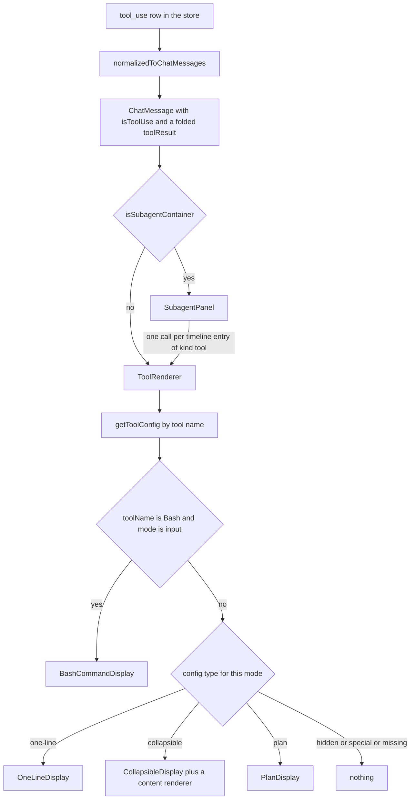
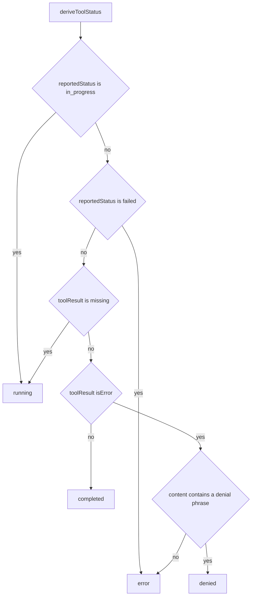
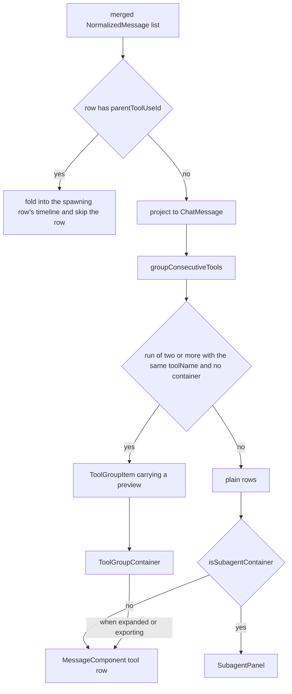
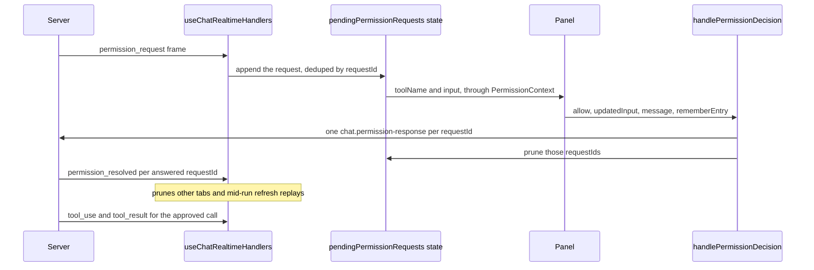

# Tool views

## In one paragraph

A provider says a tool ran by sending a `tool_use` frame and, later, a `tool_result` frame.
This subsystem turns that pair into one card in the transcript: a command row, a diff, a
checklist, a file list, a subagent timeline. What a tool looks like is not a conditional in
a component. It is one entry in a registry keyed by the tool's name, and `ToolRenderer`
switches on that entry. The hard parts are not the drawing. They are pairing a call with a
result that arrives seconds later, deciding what to show in between, collapsing runs of the
same tool into one row, and nesting a running subagent's calls inside the row that spawned
it.

Read [the realtime stream](./02-realtime-stream.md) first for how the frames arrive, and
[the message store](./04-message-store-and-lazy-loading.md) for what `merged` means.

## Mental model

1. **One call is one row.** `normalizedToChatMessages` folds a `tool_result` onto its
   `tool_use` by `toolId` before any component runs. A standalone result renders as its own
   row only when it has no `toolId` at all; a result whose `toolId` matches nothing loaded
   is dropped, not drawn.
2. **The tool's name is the only lookup key, and the lookup is exact.**
   `getToolConfig(name)` returns `TOOL_CONFIGS[name]` or `TOOL_CONFIGS.Default`. So an
   unmapped tool always renders as a closed collapsible whose title is a summary of its
   input, and `mcp__github__create_pr` never matches anything but `Default`.
3. **`ToolRenderer` draws one side of one row per call, at most twice.** `mode="input"`
   reads `config.input`, `mode="result"` reads `config.result`. `MessageComponent` makes
   both calls; `SubagentPanel` makes only the `mode="input"` one.
4. **Status is a pure function of two values.** `deriveToolStatus(toolResult,
   reportedStatus)` checks the provider-reported lifecycle first, then falls back to the
   presence of a result. It is computed only on `mode === 'input'`, so a result section
   never carries a badge.
5. **A failed result never reaches `config.result`.** `MessageComponent` routes `isError`
   to `ToolErrorDisplay`. The one exception is `Bash`, whose failure is already inside its
   command card.
6. **Anything that is not a plain tool row is decided before `ToolRenderer` sees it.**
   `groupConsecutiveTools` turns runs into `ToolGroupItem`s in the message array;
   `MessageComponent` routes `isSubagentContainer` to `SubagentPanel`. `ToolRenderer` does
   not know either exists.
7. **`Bash` is one card, not two.** Its input render owns the command and the output, and
   `MessageComponent` suppresses the separate result section for it by name.
8. **Every collapsed surface reads `useIsExportingTranscript()` — except
   `ToolErrorDisplay`.** An exported document has no chevron to click, so a section that
   ignores the flag exports empty. `ToolErrorDisplay` ignores it, which is why an exported
   failure shows only its truncated one-line preview.

## The pieces

| File | Role |
| --- | --- |
| `src/modules/chat/tools/configs/toolConfigs.ts` | `TOOL_CONFIGS` registry, the `ToolDisplayConfig` type, `getToolConfig`, `shouldHideToolResult`, `formatToolDisplayName`, `UNIFIED_TOOL_LABELS` |
| `src/modules/chat/tools/ToolRenderer.tsx` | The router. Config in, component out. Also `getToolCategory`, `deriveToolStatus`, `CLAUDE_DENIAL_MESSAGES` |
| `src/modules/chat/tools/OneLineDisplay.tsx` | Compact single-row pattern, four layouts |
| `src/modules/chat/tools/CollapsibleDisplay.tsx` | Expandable pattern. Owns the category border colour and the `raw params` sub-toggle |
| `src/modules/chat/tools/CollapsibleSection.tsx` | The header, chevron and sticky behaviour every expandable tool shares |
| `src/modules/chat/tools/BashCommandDisplay.tsx` | Bash's whole card: command, spinner, line count, expandable output |
| `src/modules/chat/tools/ToolStatusBadge.tsx` | `STATUS_CONFIG`, one pill per `ToolStatus` |
| `src/modules/chat/tools/ToolErrorDisplay.tsx` | Collapsed red row for a failed result |
| `src/modules/chat/tools/ToolDiffViewer.tsx` | Inline added and removed lines for Edit, Write, ApplyPatch |
| `src/modules/chat/tools/DiffStatsBadge.tsx` | The `+12 -3` counts on a diff header and on a collapsed group |
| `src/modules/chat/tools/SubagentPanel.tsx` | The whole card for a call that spawned an agent |
| `src/modules/chat/tools/PlanDisplay.tsx` | ExitPlanMode card with the inline Build and Revise buttons |
| `src/modules/chat/tools/ContentRenderers/` | The bodies a collapsible can contain |
| `src/modules/chat/tools/InteractiveRenderers/AskUserQuestionPanel.tsx` | Keyboard-driven answer picker for an `AskUserQuestion` prompt |
| `src/modules/chat/tools/configs/permissionPanelRegistry.ts` | `registerPermissionPanel` and `getPermissionPanel`, tool name to panel |
| `src/modules/chat/transcript/MessageComponent.tsx` | Draws one transcript row. Decides container versus tool versus error |
| `src/modules/chat/transcript/ToolGroupContainer.tsx` | The collapsed `Read x4` row and its expanded children |
| `src/modules/chat/utils/toolGrouping.ts` | `groupConsecutiveTools`, `isToolGroupItem`, `buildGroupPreview` |
| `src/modules/chat/hooks/useChatMessages.ts` | `normalizedToChatMessages`: result pairing, live subagent folding, the projection cache |
| `src/modules/chat/context/TranscriptRenderContext.ts` | The "we are rendering a document" flag |
| `src/modules/chat/context/PermissionContext.tsx` | Carries the pending prompts and the callback that answers them |

## From frame to card

**RULE: the config decides the component. The renderer only dispatches.**



Three lookups happen before the switch, all inside `ToolRenderer`:

- `getToolConfig(toolName)` picks the entry. Lookups always use the provider's real tool
  name, never the display name.
- `formatToolDisplayName(toolName)` produces the header text. `UNIFIED_TOOL_LABELS` maps
  `TodoWrite` and `TodoRead` to `Checklist` and `AskUserQuestion` to `Question`; otherwise
  `mcp__<server>__<tool>` becomes `<tool> (<server>)`; otherwise the name passes through.
- `parseToolPayload(payload)` (`src/modules/chat/utils/messageTransforms.ts`) parses the
  payload for the current mode. `normalizedToChatMessages` serializes `toolInput` to a JSON
  string on every row, so every `getValue`, `title` and `getContentProps` receives a parsed
  object — or the original string, when it is not JSON.

### The config shape

`config.input` — how the call renders.

| Field | Type | Meaning |
| --- | --- | --- |
| `type` | `'one-line' \| 'collapsible' \| 'plan' \| 'hidden'` | Picks the base pattern. `hidden` is declared but no entry uses it; it falls through the switch and renders nothing |
| `label` | `string` | Text before the separator. Defaults to the display name |
| `icon` | `string` | Replaces the label in `OneLineDisplay`. Only `'terminal'` is used, and every variant special-cases it |
| `style` | `string` | `'terminal'` switches `OneLineDisplay` to the dark command pill |
| `getValue` | `(input) => string` | The main text of a one-line row |
| `getSecondary` | `(input) => string \| undefined` | Italic trailing text, such as Grep's `in <path>` |
| `action` | `'copy' \| 'open-file' \| 'jump-to-results' \| 'none'` | What a click does, and which of the last three layouts renders |
| `wrapText` | `boolean` | Wrap instead of truncate the value |
| `colorScheme` | `{primary, secondary, background, border, icon}` | Tailwind classes. `border` and `icon` are also read by `ToolGroupContainer` for the collapsed group row |
| `title` | `string \| (input) => string` | Header of a collapsible or plan card |
| `defaultOpen` | `boolean` | Initial open state. Forced open while exporting |
| `contentType` | `'diff' \| 'markdown' \| 'file-list' \| 'todo-list' \| 'text' \| 'task' \| 'question-answer'` | Which content renderer fills a collapsible body |
| `getContentProps` | `(input, helpers) => object` | Props for that renderer. `helpers` carries `{selectedProject, createDiff, onFileOpen}` |
| `actionButton` | `'file-button' \| 'none'` | Never read. Edit, Write and ApplyPatch set it to `'none'`; nothing sets `'file-button'` |

`config.result` — how a successful result renders. **Its unions are not the same as
`input`'s.** `type` drops `'hidden'` and adds `'special'`. `contentType` drops `'diff'` and
adds `'success-message'`. `getContentProps` and `title` take the result object and receive
no `helpers`.

| Field | Type | Meaning |
| --- | --- | --- |
| `hidden` | `boolean` | Never show the result. Set by `Read`, `ExitPlanMode`, `exit_plan_mode` |
| `hideOnSuccess` | `boolean` | Show failures only. Set by Bash, PowerShell, Edit, Write, ApplyPatch, TodoWrite, TaskCreate, TaskUpdate, Agent, AskUserQuestion |
| `type` | `'one-line' \| 'collapsible' \| 'plan' \| 'special'` | `'special'` matches no branch. Bash and PowerShell use it to mean "there is no separate result card" |
| `contentType` | `'markdown' \| 'file-list' \| 'todo-list' \| 'text' \| 'success-message' \| 'task' \| 'question-answer'` | No `'diff'` — a result has nothing to diff against |
| `getMessage` | `(result) => string` | Text for `'success-message'`. No entry sets either |

`shouldHideToolResult(toolName, toolResult)` is the gate. It returns `false` when the
config has no `result` block, then `false` again when `toolResult.isError` — so a `hidden`
or `hideOnSuccess` config can never swallow a failure — then `true` for `hidden`, then
`true` for `hideOnSuccess` once a result exists.

### The one-line layouts

`OneLineDisplay` picks its layout in this order, and only the last three are chosen by
`action`:

| Condition | Renders |
| --- | --- |
| `style === 'terminal'` | A dark pill with a green `$` prefix and no left border. A copy button when `action` is `copy` |
| `action === 'open-file'` | The basename as a button that calls `onFileOpen(getValue(input))` |
| `action === 'jump-to-results'` | The value, plus — once `toolResult` exists — a down-arrow link to `#tool-result-<toolId>`, the id `MessageComponent` puts on the result wrapper |
| otherwise | Label, separator, value, optional secondary. A copy button when `action` is `copy` |

The last three carry a `border-l-2` in `colorScheme.border`. `action: 'copy'` is not a
layout of its own — it only adds the hover copy button.

### The collapsible pattern

`CollapsibleDisplay` wraps `CollapsibleSection` — a `Collapsible` whose header goes sticky
while open — inside a `border-l-2` coloured by `getToolCategory(toolName)`:

| Category | Tools | Border |
| --- | --- | --- |
| `edit` | Edit, Write, ApplyPatch | amber |
| `search` | Grep, Glob | muted |
| `bash` | Bash | green |
| `todo` | TodoWrite, TodoRead | violet |
| `task` | TaskCreate, TaskUpdate, TaskList, TaskGet | violet |
| `agent` | Task | purple |
| `plan` | exit_plan_mode, ExitPlanMode | indigo |
| `question` | AskUserQuestion | blue |
| `default` | everything else, including `Agent` | plain border |

`CollapsibleDisplay` also owns the `raw params` sub-toggle, shown when the user has enabled
`showRawParameters` and only on `mode === 'input'`. Header badges are assembled in
`ToolRenderer`: diff stats first, then the status pill.

### Worked example: adding a tool

One registry entry, plus one line if it needs its own border colour.

```ts
// 1. src/modules/chat/tools/configs/toolConfigs.ts — key it by the exact name the
//    provider emits.
NotebookEdit: {
  input: {
    type: 'collapsible',
    title: (input) => input.notebook_path?.split('/').pop() || 'notebook',
    defaultOpen: false,
    contentType: 'diff',
    getContentProps: (input) => ({
      oldContent: '',
      newContent: input.new_source ?? '',
      filePath: input.notebook_path,
      badge: 'Cell',
      badgeColor: 'green',
    }),
  },
  result: { hideOnSuccess: true },  // failures still render, via ToolErrorDisplay
},

// 2. src/modules/chat/tools/ToolRenderer.tsx → getToolCategory
if (['Edit', 'Write', 'ApplyPatch', 'NotebookEdit'].includes(toolName)) return 'edit';
```

The row then gets, for free: a `Running` badge until its result lands, a `+N -M` badge from
the session's cached diff calculator, collapsing into a `NotebookEdit x4` group whose
preview names the first two notebooks and whose header totals their diffs, correct
rendering inside a subagent timeline, and inclusion in the HTML export with the section
forced open.

## Status

**RULE: the provider's reported lifecycle wins; otherwise the presence of a result decides.**



The order matters. `in_progress` reads as running even when a partial result has already
arrived, which is how a Codex command streams its output into a row that still says
running. `failed` reads as error even when no result ever arrives.

`reportedStatus` is `message.toolStatus`, which is `NormalizedMessage.status`. Only the
Codex provider sets it — on `command_execution`, `file_change` and `mcp_tool_call`. Claude
rows never carry one, so their status is always inferred.

| Status | Badge | Shown when |
| --- | --- | --- |
| `running` | blue `Running` | Codex reported `in_progress`, or there is no result yet |
| `completed` | none | A result with no `isError`. `STATUS_CONFIG` has a green `Completed` pill, but every caller passes `undefined` for this status, so it never renders |
| `error` | red `Error` | Codex reported `failed`, or the result has `isError` |
| `denied` | orange `Denied` | `isError` and the lowercased, trimmed content **contains** one of `CLAUDE_DENIAL_MESSAGES`: `user denied tool use`, `tool disallowed by settings`, `permission request timed out`, `permission request cancelled` |

The four phrases are the deny messages `canUseTool` returns in
`claude-runtime.provider.js`. They are capitalized at the source, so the check lowercases,
and it is a substring test rather than equality so it survives the SDK wrapping the message
in error text. A deny carrying a different message does not match — `canUseTool` returns
the client's `decision.message` verbatim when one is supplied — so a custom deny reason
lands on `error`, not `denied`.

Two rows spell "running" their own way. `BashCommandDisplay` draws a spinning ring and
suppresses the pill; `PlanDisplay` shimmers its title while `mode === 'input' &&
!toolResult`. Nothing times a call out: a `tool_use` whose result never arrives stays
`Running` until a REST history refresh re-pairs it from the transcript file.

## Pairing a call with its result

**RULE: pairing happens once, in the projection, keyed by `toolId`.**

`normalizedToChatMessages` (`src/modules/chat/hooks/useChatMessages.ts`) makes two passes
over the store's `merged` array.

The first pass builds `toolResultMap: Map<toolId, NormalizedMessage>` from every
`tool_result` row and `toolUseIds: Set<toolId>` from every `tool_use` row. The second
attaches `msg.toolResult || toolResultMap.get(msg.toolId)` to each call and runs the
content through `formatToolResultContent`, which unwraps a
`<tool_use_error>…</tool_use_error>` envelope.

A standalone `tool_result` row is then skipped twice over. If its id is in `toolUseIds` the
call already carries it. **If it has any `toolId` at all it is skipped anyway** — an
unmatched id almost always means the `tool_use` sits on a history page that is not loaded
yet, and drawing the raw content would produce an unstyled dump that "fixes itself" when
the older page arrives. Only a result with no `toolId` and non-empty content renders on its
own.

Projections are cached in a `WeakMap` keyed by the source `NormalizedMessage`. The entry
stores `toolResultSource` and `subagentActivitySource` alongside the produced messages, so
a row is rebuilt when its result lands or its subagent timeline grows, even though the
`tool_use` record itself never changed.

**What renders in between.** The input card appears the moment the call arrives, and it is
not frozen: the status badge changes, Bash grows an expandable output section, and a
`jump-to-results` row grows its down-arrow link. All three appear only once `toolResult` is
non-null.

## Grouping consecutive calls

**RULE: two or more consecutive calls to the same tool collapse into one row. A call that
spawned an agent never joins one.**



`groupConsecutiveTools(messages, showThinking = true)` walks the list once. A message is
groupable when `isToolUse && toolName && !isSubagentContainer`. A run extends while the
next message is groupable and has the same `toolName`. A message that renders nothing —
reasoning while `showThinking` is off — is skipped rather than treated as a break, because
Codex interleaves hidden reasoning between consecutive tool calls. Those skipped rows are
consumed: they do not reappear in the returned list. `TOOL_GROUP_THRESHOLD` is 2, so a run
of one is pushed through unchanged. The group carries the run's **first** timestamp, which
is the `data-message-timestamp` the transcript search jump matches on.

The preview is built during grouping, not during render, by `buildGroupPreview`. The first
`PREVIEWED_TOOL_COUNT = 2` messages are named by `getToolInputPreview`, which prefers the
config's `getValue` then its `title`; empties are filtered out. The remainder is
`messages.length - named.length`, so **the names printed plus the remainder always equal
the `x{n}` badge**. That is the invariant
`src/modules/chat/tests/toolGrouping.test.ts` is built around: a run of two where one input
yields no text reads `/a.ts, +1 more`, and a run of five that names nothing reads
`+5 more`.

`ToolGroupContainer` builds the collapsed button from the same config the cards use:
`config.label` or the tool name, `config.colorScheme.border`, `config.colorScheme.icon`
with `terminal` mapped to `$` and anything absent to the tool's uppercased first letter,
the `x{n}` badge, the preview, and — via `useGroupDiffStats` — the summed `+N -M` for a run
whose config has `contentType: 'diff'`. Expanding it renders the run's real
`MessageComponent` rows.

## Subagents

**RULE: a row is a subagent container when the backend attached agent metadata to it, a
live task status named it, or its tool name is `Task` or `Agent`.**

`normalizedToChatMessages` sets `isSubagentContainer` from `Boolean(subagent)`, where
`subagent` is the history-attached metadata merged with the newest live task status, and
falls back to `toolName === 'Task' || toolName === 'Agent'` for the moment before either
has arrived. `MessageComponent` then hands the whole row to `SubagentPanel` and never calls
`ToolRenderer` for it.

The panel's header shows the agent type, description, nickname, and a status of running,
stopped, failed, or `N tools` — `done` when the agent completed without running any. While
open it shows the model, the running token/tool totals when the provider reports them, the
task prompt, the timeline, and the agent's markdown result. A timeline entry of
`kind: 'tool'` goes through `ToolRenderer` with `mode="input"` — the same router the main
thread uses — so a subagent's shell command looks identical to the parent's. Entries of
kind `text` and `thinking` render as notes.

**Where the status comes from.** `resolveSubagentStatus` in
`src/modules/chat/subagents/subagentStatus.ts` is the only place a lifecycle state is
decided: the provider's reported status wins, and only an agent without one is inferred
from its result. That inference must never read a launch acknowledgement as an answer — an
async agent's result comes back the instant it is admitted, which is what made a
still-running agent render as finished. The four states and how each is drawn live in
`SUBAGENT_STATUS_PRESENTATION`, shared with the subagent list so one agent is never
described two ways.

Two caps matter. `INITIALLY_RENDERED_ACTIVITIES = 25` bounds how many entries mount, and
the "show N more" button raises the limit by four times that. Separately,
`subagent.activityCount` minus the received length renders as "N earlier steps are not
included", because the backend truncates long timelines for transport; that line appears
only once nothing is left to expand locally.

**Live nesting.** A running subagent's rows arrive stamped with `parentToolUseId` — Claude's
`parent_tool_use_id`, preserved by `transformMessage` in `claude-runtime.provider.js`. The
first pass of `normalizedToChatMessages` folds them into a per-parent `SubagentActivity[]`:

| Folded row | Becomes |
| --- | --- |
| `tool_use` | A `kind: 'tool'` entry, indexed by `toolId` so its result can attach later |
| `tool_result` | `toolResult` on the already-indexed entry. Never a new entry, and dropped entirely if its call was not seen |
| `thinking`, or `text` with `role: 'assistant'` | A note entry, unless its content is blank |
| `text` with any other role | Nothing. A user-role row there is the echoed task prompt, which the card already shows |
| anything else | Nothing |

Every folded row is skipped by the second pass, so it never renders top-level. When a
history load later attaches the server-indexed `subagentTools`, **the longer of the two
lists wins** — a mid-run refresh can attach a partial server timeline while newer live rows
keep streaming. The projection cache's second key, `subagentActivitySource`, holds the
newest row folded into that container, so a growing timeline invalidates the cached card.

**The live task stream.** The rows above describe what an agent *did*; they cannot say
whether it is still doing it. Claude sends that separately, as `system` task events that
`normalizeClaudeTaskEvent` in `claude-sessions.provider.ts` turns into `subagent_update`
frames carrying the spawning `tool_use_id`. `task_started` and `task_progress` keep the
agent running and carry its token/tool totals; `task_notification` closes it. Three
consequences worth holding:

- **A status is folded, never drawn.** The first pass collects the newest status per
  `toolUseId`; the second pass skips those frames entirely, and the container merges them
  over its history metadata. The projection cache's third key, `subagentStateSource`,
  holds the newest status so a card is rebuilt when its agent moves on.
- **Live status outranks history.** A mid-run reload ships the agent as finished because
  the backend can only read its transcript; the stream is the only side that knows better.
- **A cancellation is not a failure.** `stopped` is its own state, end to end, so an agent
  the user cancelled is not drawn as a broken one.

`SubagentsPanel` (`src/modules/chat/subagents/`) is the always-reachable index over the
same data: it lists every agent in the session, expands itself while one is active, and
scrolling to a card is driven through `SubagentFocusContext`.

`src/modules/chat/tests/liveSubagentGrouping.test.ts` pins the folding behaviours, and
`src/modules/chat/tests/subagentStatus.test.ts` pins the status resolution.

## Errors

**RULE: a failed result is rendered by `MessageComponent`, not by `ToolRenderer`.**

The result section of `MessageComponent` reads, in order:

- skip entirely when there is no `toolResult`;
- skip when the tool is `Bash` — its output, success or failure, is already inside
  `BashCommandDisplay`, which turns its border and output text red on `isError`;
- skip when `shouldHideToolResult(toolName, toolResult)` says so;
- when `toolResult.isError`, render `ToolErrorDisplay`;
- otherwise render `ToolRenderer` with `mode="result"`.

Both of the last two branches sit inside a wrapper carrying
`id="tool-result-<toolId>"`, which is what the `jump-to-results` arrow links to.

Errors sit outside the router because `config.result` describes a *successful* payload —
Grep's `Found 3 files`, read off the result's `toolUseResult`; TodoRead's parsed array; the
`Default` entry's MCP block unwrapping. Feeding an error string to those shapers produces
`Found 0 files` on a call that crashed. `ToolErrorDisplay` ignores the config entirely and
renders one uniform collapsed red row: a truncated one-line preview that expands to the
full text as markdown.

Errors deliberately do **not** auto-expand. The red border and the `Error` badge already
signal the failure, and a stack trace should not push the rest of the transcript off screen.

## Interactive tool views

**RULE: a permission prompt picks its panel by tool name, and the answer travels back as a
`chat.permission-response` frame carrying `requestId`.**



The list is a `useState` in `useChatProviderState.ts`. `useChatRealtimeHandlers` appends to
it on a `permission_request` frame, and only when the frame's session is the one on screen.
`handlePermissionDecision` in `useChatComposerState.ts` accepts one id or many, sends one
`chat.permission-response` frame per id carrying `allow`, `updatedInput`, `message` and
`rememberEntry`, then optimistically prunes those ids from the list. `ChatInterface.tsx`
publishes the list and the callback as `permissionContextValue` on `PermissionContext`; the
context is a plain carrier and `usePermission()` returns `null` outside the provider. The
optimistic prune only covers the answering tab; the server's `permission_resolved` frame
does the same removal everywhere else — other tabs, and the replay a refreshed tab
receives mid-run. A `permission_cancelled` frame removes a prompt with no decision at all.

Three consumers pick a panel three different ways:

| Prompt | Panel | How it is chosen |
| --- | --- | --- |
| `ExitPlanMode` or `exit_plan_mode` | `PlanDisplay`, inline in the transcript | `PlanDisplay` calls `usePermission()` and searches the pending list itself, by tool name. `PermissionRequestsBanner` filters those two names out so the prompt is not offered twice |
| `AskUserQuestion` | `AskUserQuestionPanel`, above the composer input | `getPermissionPanel(request.toolName)` from `permissionPanelRegistry.ts` |
| anything else | The generic `Confirmation` banner | Fallback in `PermissionRequestsBanner` |

`PlanDisplay` shows its footer only while a plan request is pending, and sends
`{allow: true}` for Build and `{allow: false, message: 'User asked to revise the plan'}`
for Revise.

The generic banner offers three actions. **Deny** sends `{allow: false, message: 'User
denied tool use'}`. **Allow once** sends `{allow: true}`. **Allow & remember** computes a
permission entry with `buildClaudeToolPermissionEntry`, appends it to the stored
`allowedTools` — only when the provider is `claude`; the button is disabled outright when
no entry can be derived — and then answers *every* pending request that computes the same
entry in one call. That batch is why `handlePermissionDecision` takes an array of ids.

`AskUserQuestionPanel` is a keyboard-first stepper: number keys pick options, `0` toggles a
free-text "Other", `Enter` advances or submits on the last question, `Escape` skips. It
always answers `allow: true`; the content of the answer rides in
`updatedInput: {...input, answers: {[question]: 'a, b'}}`, and skipping sends
`answers: {}`. On a later history load the server folds those answers back into the tool
input (`unifyAskCall` in `server/shared/message-unification.ts`), which is why
`AskUserQuestion`'s config reads `input.answers` and its title can say
`Approach — Rewrite it`.

The registry is one `Record<string, ComponentType<PermissionPanelProps>>` with two
functions. Registration is a module-scope side effect in
`src/modules/chat/composer/PermissionRequestsBanner.tsx` — the same file that reads it. One
panel is registered today.

## Content renderers

Every `contentType` maps to exactly one component, chosen by the `switch` inside
`ToolRenderer`'s collapsible branch. They are stateless renderers of already-shaped props;
the shaping lives in the config's `getContentProps`.

| `contentType` | Component | Reached by | Notes |
| --- | --- | --- | --- |
| `diff` | `ToolDiffViewer.tsx` | Edit, Write, ApplyPatch inputs | Memoizes `createDiff(old, new)`. Renders nothing at all when no `createDiff` is passed |
| `markdown` | `ContentRenderers/MarkdownContent.tsx` | Agent input, Task input and result | A thin wrapper over the transcript `Markdown` |
| `file-list` | `ContentRenderers/FileListContent.tsx` | Grep and Glob results | Comma-separated basenames, click to open, capped at `max-h-48` |
| `todo-list` | `ContentRenderers/TodoListContent.tsx` → `TodoList.tsx` → `Queue.tsx` | TodoWrite input, TodoRead result | `TodoListContent` keeps only values with string `content` and `status`; `TodoList` normalizes the status and renders a `Queue` |
| `task` | `ContentRenderers/TaskListContent.tsx` | TaskList and TaskGet results | Regex-parses `#15. [in_progress] Subject` lines out of plain text into rows |
| `question-answer` | `ContentRenderers/QuestionAnswerContent.tsx` | AskUserQuestion input | The only stateful renderer — it expands one question at a time. Guards every field, because transcript payloads are runtime data |
| `text` | `ContentRenderers/TextContent.tsx` | Default, exec, WebSearch, WebFetch | `format` is `'plain' \| 'json' \| 'code'`; no config sets `'json'` |
| `success-message` | inline SVG in `ToolRenderer` | nothing | The branch exists; no config sets the type or `getMessage` |

`ExitPlanMode` and `exit_plan_mode` declare `contentType: 'markdown'`, but they never reach
this switch: `type: 'plan'` returns earlier, and `PlanDisplay` reads `contentProps.content`
directly.

`DiffStatsBadge.tsx` is not a content renderer. It is a header badge, rendered in two
places: the collapsible header of each diff tool, and the collapsed group row via
`useGroupDiffStats`. Both compute it through `createDiff`, the session's cached calculator
from `createCachedDiffCalculator`, so the badge cannot disagree with the diff the user sees
on expand. It omits a side with no lines, so a new file reads `+40` rather than `+40 -0`,
and it renders nothing when both are zero.

## Rendering into an exported document

**RULE: `TranscriptRenderContext` exists to reach leaves that memoized components sit
between.**

It carries one boolean, `isExporting`, defaulting to `false`, read through
`useIsExportingTranscript()`. It is provided in exactly one place,
`src/modules/chat/export/TranscriptExportDocument.tsx`, which mounts the *real* transcript
components under `renderToStaticMarkup` so an exported file cannot drift from the UI.

Five components consume it, none of them a direct child of the provider:
`CollapsibleSection` opens every tool section, `SubagentPanel` opens the timeline and lifts
the 25-entry cap, `ToolGroupContainer` expands the group, `BashCommandDisplay` opens its
output, and `MessageComponent` drops the copy and speak controls and opens reasoning.
Prop-drilling to all five would mean threading a flag through `ChatMessagesPane`,
`LazyMessageRow`, `MessageComponent`, `ToolRenderer` and `CollapsibleDisplay` — every one
memoized, and four with no other reason to know exports exist.

## Gotchas and why the code looks like this

- **The group preview is computed during grouping and not cached, on purpose.** Grouping
  re-runs on every 100 ms stream tick because `visibleMessages` is a fresh array. Measured
  at 0.18 ms per tick over a 100-message window, a seventh of the store's own per-tick
  merge. The obvious cache is unsound: a run's preview depends on the second message *and*
  the run length, so keying on first-message identity pins `/a.ts, /b.ts` while the badge
  climbs to `x5`. `ToolGroupContainer` is memoized anyway but cannot bail during streaming
  for the same reason (commit `2a11562f`).
- **`extraCount` subtracts the previews that produced text, not the two slots the line
  reserves.** The alternative was tried and reverted. Counting slots makes a group of three
  whose first preview is empty render `/b.ts, +1 more` beside an `x3` badge — the line and
  the badge disagreeing about how many calls there were. Subtracting named previews keeps
  `named + extraCount === messages.length` for every input (commit `52be4a60`).
- **`toolInput` is a JSON string on every `ChatMessage`.** `ToolRenderer` parsed it inline
  and the new group header did not, so per-card diff stats rendered and the group total
  silently did not — while its test, which passed an object literal, went green. Both now
  go through `parseToolPayload`, and the fixtures build the string shape the app produces
  (commit `1236ded9`).
- **Subagent routing is in `MessageComponent`, not `ToolRenderer`.** `SubagentPanel`
  imports `ToolRenderer`; if `ToolRenderer` also chose the panel, the two would import each
  other. `tools/index.ts` exists for the same reason: it still re-exports `ToolRenderer`
  for `MessageComponent`, but `ToolRenderer` now imports each sibling by direct path
  instead of back through the barrel, and the `ContentRenderers/` and
  `InteractiveRenderers/` barrels that made the cycle possible are gone.
- **`SubagentPanel` does not use the shared `Collapsible`.** That primitive keeps children
  mounted while closed; for an agent that ran a hundred tools that is a hundred tool
  renderers behind a collapsed header. The timeline mounts only while open, in pages of 25
  (commit `7113270e`).
- **A running subagent's rows used to render as the session's own calls** and jump inside
  the panel only after a refresh. They are now folded live by `parentToolUseId`, with the
  longer of the live and server timelines winning a mid-run history refresh (commit
  `21a3489f`). Two separate guards drop the echoed task prompt: the server refuses to send
  it at all (`isSubagentPromptEcho` in `claude-runtime.provider.js`), and the client's fold
  keeps only `thinking` and assistant-role `text`, because in a subagent's transcript the
  user-role rows are its tool results and that same prompt. `liveSubagentGrouping.test.ts`
  pins the client half.
- **The `Task` and `Agent` registry entries are almost unreachable.** Any row with those
  names is forced to `isSubagentContainer`, so `MessageComponent` sends it to
  `SubagentPanel` and `groupConsecutiveTools` refuses to group it. The entries only matter
  when a subagent's own timeline contains a nested `Task`, which `SubagentPanel` renders
  through `ToolRenderer`. The comment on `Agent` claiming the config feeds tool grouping is
  wrong.
- **The `Default` config summarizes the call from its own input**, probing
  `DESCRIPTIVE_INPUT_KEYS` most-specific-first. Before that, every unmapped tool rendered
  `<name> / Parameters`, and a grouped run of them collapsed into
  `Parameters, Parameters, +1 more`.
- **`Bash` is the one tool name the renderer branches on for layout.** Its command and
  output are one card, so the input render owns both and `MessageComponent` suppresses the
  separate result section. Its `result.type: 'special'` matches no branch, which is the
  intended outcome. `PowerShell` carries the same config but goes through
  `OneLineDisplay`'s terminal variant, because only `Bash` is special-cased. `ToolRenderer`
  has one other tool-name branch: Edit, Write and ApplyPatch get a clickable title that
  opens the file with the diff.
- **A Bash command row never auto-opens on screen.** The auto-open effect in
  `BashCommandDisplay` fires only when `defaultOpen` is true, and its only caller —
  `ToolRenderer` — hard-codes `defaultOpen={false}` so failures do not expand either. That
  leaves `isExporting` as the only thing that opens the output, which is also why the
  component reads the flag directly: `renderToStaticMarkup` runs no effects, so Bash output
  was missing from exports entirely (commit `e35476fd`).
- **Collapsed rows avoid `<code>` and `<pre>` tags.** A global `.chat-message code` rule
  forces `white-space: pre-wrap !important`, which defeats `truncate` and renders a
  collapsed multi-line command in full. `BashCommandDisplay` and `ToolErrorDisplay` both
  carry that comment.
- **`ToolErrorDisplay` is the one collapsed surface that ignores `isExporting`.** An
  exported failure therefore shows its truncated one-line preview and not the full text.
- **`PlanDisplay` matches a pending request by tool name only.** Nothing ties the request
  to the card's own `toolId`, so while a plan prompt is pending, every `ExitPlanMode` card
  in the transcript shows the Build and Revise footer, including older ones.
- **Checklists and questions are labelled by surface, not by tool, and the rewrites happen
  in two different places.** `prepareTranscriptMessages`
  (`server/shared/message-unification.ts`) rewrites Claude's `TaskCreate`, `TaskUpdate`,
  `TaskList` and `TaskGet` onto `TodoWrite`, and Codex's `request_user_input` onto
  `AskUserQuestion` — but only for REST history. Codex's `update_plan` is renamed to
  `TodoWrite` inside the Codex provider itself, live as well as on history. The canonical
  names are Claude's, so `UNIFIED_TOOL_LABELS` relabels the result `Checklist` and
  `Question` (commit `2bec6a5c`).
- **Live and history render the same conversation differently, but not in the way the
  duplicate result rows suggest.** Results fold onto their calls in the client either way.
  What changes on a refresh is server-side: `prepareTranscriptMessages` drops the now
  redundant standalone result rows from the payload, replays the incremental task calls
  into one checklist snapshot, discards consecutive snapshots that did not change, folds
  answers into `AskUserQuestion`, and caps oversized tool output. So mid-run you see a
  column of violet `Task / subject` one-liners; after a refresh they are one `Checklist`
  card.
- **Some declared things are never read.** `input.actionButton`, `input.type: 'hidden'`,
  `result.contentType: 'success-message'` and `result.getMessage`, `TextContent`'s
  `format: 'json'`, `OneLineDisplay`'s `resultId` prop — the anchor is built from `toolId`
  inside the component — `CollapsibleDisplay`'s `action` prop, and `PlanDisplay`'s `toolId`
  and `toolName` props. Do not copy them into a new config expecting behaviour.
- **`src/modules/chat/tools/README.md` is a stale draft.** It describes a `components/`
  directory that does not exist and a `success-message` result for TodoWrite that is now
  `hideOnSuccess`, and it predates `question-answer`, the `denied` status, subagents and
  permissions. Verify against the code, not against it.

## If you change this, check that

| If you touch | Also check |
| --- | --- |
| `TOOL_CONFIGS` entry shape | `ToolRenderer`'s three `type` branches and its `contentType` switch; the `input` and `result` unions differ, so a field valid on one may not be on the other; `ToolGroupContainer` reads `label`, `colorScheme` and `contentType` off the same config |
| `getToolConfig` fallback | `toolGrouping.ts` → `getToolInputPreview` calls it for the collapsed line, so an unmapped tool must still name what it did |
| `deriveToolStatus` | `ToolStatusBadge`'s `STATUS_CONFIG` needs a key for every `ToolStatus`; `BashCommandDisplay` and `OneLineDisplay` both special-case `running`; every caller filters out `completed` |
| `CLAUDE_DENIAL_MESSAGES` | The exact strings the Claude runtime adapter emits. The test is `includes` on lowercased content, so a rewording silently downgrades `denied` to `error` |
| Result pairing in `normalizedToChatMessages` | The `WeakMap` projection cache keys `toolResultSource` and `subagentActivitySource`, and `src/modules/chat/tests/useChatMessages.test.ts` |
| `groupConsecutiveTools` | `src/modules/chat/tests/toolGrouping.test.ts`; `ChatMessagesPane`'s key map, which assigns keys per group member; and `useChatSessionState`'s search jump, which matches a group by its first timestamp |
| `parentToolUseId` handling | `liveSubagentGrouping.test.ts`, and `isSubagentPromptEcho` in `claude-runtime.provider.js` — the two must agree on which rows are echoes |
| Anything with `useState` open or closed state | Add a `useIsExportingTranscript()` read, or it exports as an empty section; `src/modules/chat/tests/transcriptExport.test.tsx` asserts this |
| `PermissionPanelProps` | `permissionPanelRegistry.ts`, `AskUserQuestionPanel`, and `handlePermissionDecision` in `useChatComposerState.ts`, which is what sends the frame |
| `toolInput` serialization in the projection | Every `getValue`, `title` and `getContentProps` in the registry, plus the `parseToolPayload` call sites in `ToolRenderer` and `ToolGroupContainer` |
| Server-side tool renaming | `UNIFIED_TOOL_LABELS`, `getToolCategory` and the `TOOL_CONFIGS` keys all match on the post-rewrite name, and the Codex provider renames some tools that `prepareTranscriptMessages` does not |
