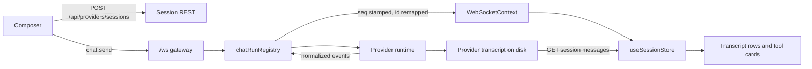

# Chat runtime architecture

*How a message gets from the composer to a provider CLI and back onto the screen.*

Six documents covering the websocket transport, the realtime stream, conversation
handoff, the message store and lazy loading, scrolling, and tool views.

These subsystems are hard to read from the source alone, because in every case the
behaviour lives in the *interaction between files* rather than in any one of them. Each
document opens with a mental model you can hold in your head, then the pieces, then the
detail, and closes with the gotchas and a coupling table.

**On citations.** Claims are anchored to a file path plus a symbol name. Line numbers are
deliberately not used — they go stale, symbol names do not. If a symbol has moved, grep
for it.

---

## The one-page picture

The shape worth memorising: **two paths carry the same conversation.** Live events come
down the websocket; persisted messages come up over REST. The store keeps them in
separate arrays and merges them for rendering. Most confusing behaviour in this area is
one of those two paths disagreeing with the other.

---

## Reading order

| # | Document | Why it comes here |
| --- | --- | --- |
| 1 | [WebSocket transport](./01-websocket-transport.md) | The pipe everything rides on. Read first — the frame tables below are its vocabulary. |
| 2 | [The realtime stream](./02-realtime-stream.md) | One run's full journey, from provider output to a rendered reply. The heart of the system. |
| 3 | [Conversation handoff](./03-conversation-handoff.md) | Which ids exist, and the four points where a conversation changes hands. Answers "why does this conversation have two ids". |
| 4 | [The message store and lazy loading](./04-message-store-and-lazy-loading.md) | Where messages live in the client, and how a huge transcript loads without freezing the tab. |
| 5 | [Scrolling](./05-scrolling.md) | Where the view sits, and why five different pieces of code move it. |
| 6 | [Tool views](./06-tool-view.md) | How a tool call becomes UI. Last, because it needs the message model from 2 and 4. |

**In a hurry?** Read 1 and 2.
**Debugging something a user can see?** Start at 5 or 6.
**Chasing a duplicated or vanishing message?** Start at 3, then 4.

---

## The protocol, in two tables

This is the shared vocabulary every document uses. Both unions are declared in
`server/shared/types.ts`.

### Server → client: the `kind` on every frame

`ServerEventKind` = `MessageKind` (emitted by provider runtimes) + `GatewayEventKind`
(added by the gateway). The frontend needs exactly one switch over it.

| `kind` | Source | Meaning |
| --- | --- | --- |
| `text` | provider | A block of assistant prose. |
| `thinking` | provider | Reasoning content, shown only when the thinking toggle is on. |
| `tool_use` | provider | A tool call, with its input. |
| `tool_result` | provider | That call's result, matched back by `toolId`. |
| `stream_delta` | provider | An incremental chunk of assistant text. |
| `stream_end` | provider | The end of a streamed block. |
| `status` | provider | Progress text, and the token-budget payload. |
| `permission_request` | provider | A tool is asking for approval. |
| `permission_resolved` | provider | A client answered that request. Retracts it from replays and other tabs. |
| `permission_cancelled` | provider | That request is no longer live (timeout, abort, withdrawal). |
| `error` | provider | An informational failure row. **Not terminal.** |
| `complete` | provider | The one terminal event of a run. Exactly one per run, always. |
| `session_created` | provider | The runtime announcing its native id. **Swallowed server-side; no client ever sees it.** |
| `history_truncated` | gateway | Rows at and after an anchor were superseded by an edit. Declared in `MessageKind`, but emitted by `chat-websocket.service.ts`, not by any runtime. |
| `task_notification` | provider | A background task finished. |
| `subagent_update` | provider | One lifecycle transition of a spawned subagent — started, progress with its running totals, or its closing status. Folded into the card for the tool call that spawned it; never drawn as a row. |
| `thinking_delta` | provider | One increment of the model's reasoning, deliberately not sharing `stream_delta`: reasoning is not the answer, and folded into it the transcript would draw thinking as something the model said. Not a row of its own — it accumulates into the live `thinking` row, which is what the reader sees while the reasoning is still being written. Present only while partial messages are on (`CLAUDE_INCLUDE_PARTIAL_MESSAGES`, on by default). |
| `chat_subscribed` | gateway | Ack for `chat.subscribe`: authoritative processing state plus pending permissions. |
| `session_upserted` | gateway | Sidebar delta. Owned by the projects state, not by chat. |
| `loading_progress` | gateway | Project scan progress. |
| `protocol_error` | gateway | The request was rejected or never started. No `complete` follows. |

One more kind never crosses the wire: **`websocket_reconnected`** is synthesized inside
`src/shared/context/WebSocketContext.tsx` when the socket re-opens, so features can catch
up on what they missed.

### Client → server: the `type` on every frame

Handled by `server/modules/websocket/services/chat-websocket.service.ts`.

| `type` | Meaning |
| --- | --- |
| `chat.send` | Start a run for a session. |
| `chat.edit-send` | Replace an already-sent message and re-run from that anchor. |
| `chat.abort` | Stop the running run, and every agent it spawned. |
| `chat.subagent-abort` | Stop one spawned agent, by the tool call that spawned it, without touching the run. |
| `chat.subscribe` | Watch one or more sessions, replaying from `lastSeq`. |
| `chat.permission-response` | Answer a `permission_request`. |

Note the asymmetry, which trips people up: **server frames are discriminated by `kind`,
client frames by `type`.**

---

## Glossary

Terms that mean something specific here and are easy to guess wrong.

| Term | Meaning |
| --- | --- |
| **App session id** | The stable id the URL, the store and every wire frame use. Minted **server-side** by `sessionsService.createAppSession` (`randomUUID()`) under `POST /api/providers/sessions`, before the first frame is sent. Never changes. |
| **Provider session id** | The id the provider CLI knows the conversation by. A backend mapping detail; the browser never learns it from a chat frame. |
| **Run** | One provider execution for one session, from `chat.send` to the terminal `complete`. Owned by `chatRunRegistry`, not by a socket — it survives disconnects and can start with no viewer at all. |
| **`seq`** | Per-run monotonic sequence number assigned server-side. A reconnecting client sends the highest it saw back as `lastSeq` to replay exactly what it missed. |
| **Replay buffer** | The run's recent events, capped per run and retained for a few minutes after it completes. A client whose `lastSeq` predates the buffer falls back to a REST history refresh. |
| **Gateway writer** | `ChatSessionWriter`, handed to provider runtimes in place of a raw socket writer. Swallows `session_created` and fans out to every socket watching the run. |
| **`serverMessages`** | Rows fetched from the persisted transcript over REST. |
| **`realtimeMessages`** | Rows that arrived over the websocket and are not yet known to be persisted. |
| **`merged`** | The projection of those two that the transcript actually renders. |
| **Slot** | One session's entry in `useSessionStore`: its message arrays plus pagination and status. Keyed by app session id, never cleared on a session switch. |
| **Tail-offset paging** | The history endpoint's `offset` counts **backwards from the newest message**. `offset: 0` is the newest page. |
| **Render window** | `visibleMessageCount` — how many fetched messages React renders. Distinct from paging, and from DOM mounting. |
| **Lazy row** | A transcript row whose content mounts only near the viewport. Its wrapper div and its measured height always stay in the DOM. |
| **Tool group** | Two or more *consecutive* calls to the *same* tool, collapsed into one summary row. |
| **Subagent container** | A tool card holding a child agent's own timeline of tool calls and prose. |

---

## Cross-cutting invariants

Five rules that hold across the whole subsystem. Breaking one causes bugs that look
unrelated to the change that caused them.

1. **The browser never learns a provider session id from a chat frame.** Every outbound
   event has its `sessionId` rewritten to the app id.
2. **Exactly one `complete` per run**, whatever happened — success, failure or abort.
   `error` is not terminal and does not end a run.
3. **A run belongs to the server, not to a socket.** It survives disconnects, serves
   several viewers at once, and may begin with no viewer at all.
4. **Live and persisted rows stay in separate arrays.** Merging them eagerly reintroduces
   duplicate rows and a transcript that flashes empty.
5. **The persisted transcript is the source of truth.** Realtime rows are an overlay,
   pruned against REST whenever a run completes.

---

## Symptom lookup

| Symptom | Start here |
| --- | --- |
| Message appears twice, or vanishes on refresh | [3](./03-conversation-handoff.md), then [4](./04-message-store-and-lazy-loading.md) |
| Spinner never stops | [2](./02-realtime-stream.md) — look for the terminal `complete` |
| A second tab froze mid-run | [1](./01-websocket-transport.md) — writer fan-out and replay |
| Transcript opens part-way up, or jumps while reading | [5](./05-scrolling.md) |
| Old messages never load, or loading is slow | [4](./04-message-store-and-lazy-loading.md) |
| A tool renders wrong, or a group collapses oddly | [6](./06-tool-view.md) |
| Nothing arrives at all after a network blip | [1](./01-websocket-transport.md) — reconnect and `lastSeq` |

---

## Related module docs

These stay authoritative for their own module's API surface; the documents above explain
how the pieces fit together.

- `server/modules/websocket/README.md` — the gateway's service map.
- `server/modules/providers/README.md` — the provider abstraction.
- `src/modules/chat/tools/README.md` — the tool config registry, from the module's side.
