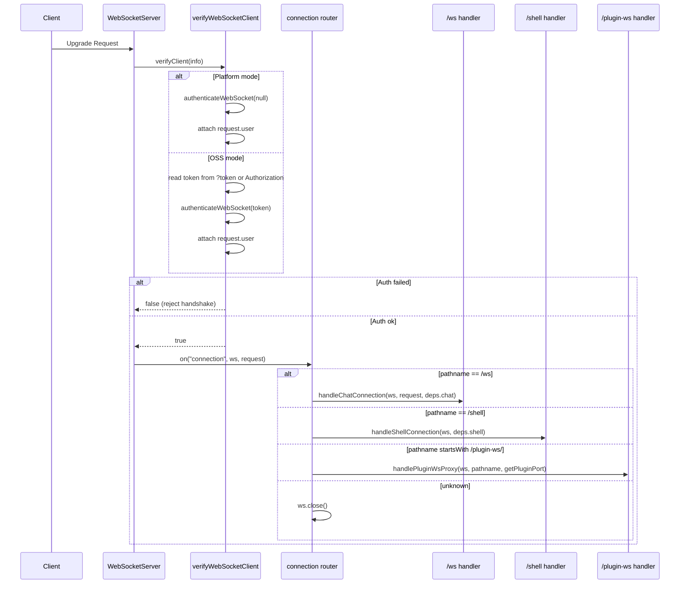
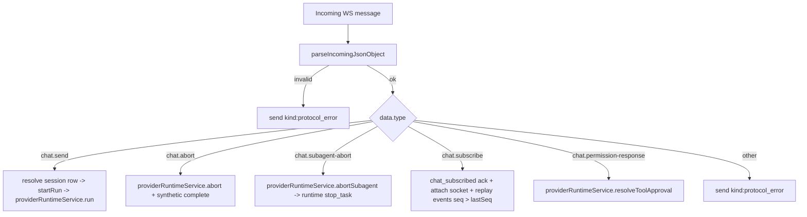
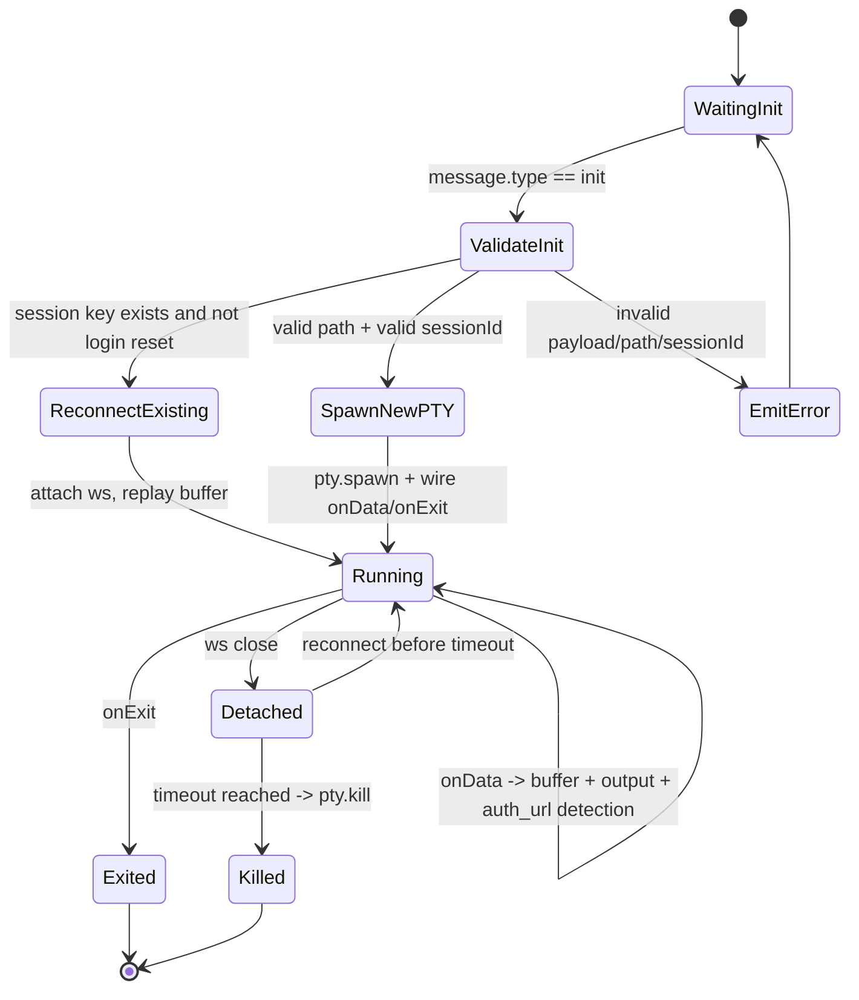
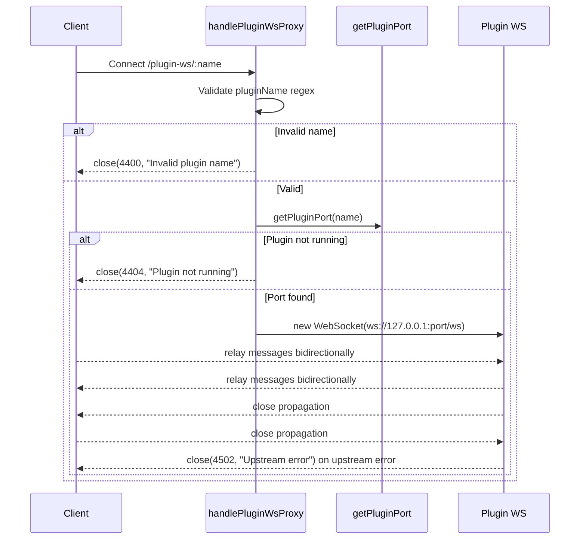

# WebSocket Module

This module owns the server-side WebSocket gateway used by:

1. Chat streaming (`/ws`)
2. Interactive terminal sessions (`/shell`)
3. Plugin WebSocket passthrough (`/plugin-ws/:pluginName`)

It is intentionally structured as **small services** plus a **barrel export** in `index.ts`.

## Public API

`server/modules/websocket/index.ts` exports:

1. `createWebSocketServer(server, dependencies)`  
Creates and wires the shared `ws` server.
2. `connectedClients` and `WS_OPEN_STATE`  
Shared chat client registry and open-state constant used by other modules.

## Why Dependency Injection Is Used

The module receives runtime-specific functions from `server/index.ts` instead of importing legacy runtime files directly.

Benefits:

1. Keeps module boundaries clean (`server/modules/*` architecture rule).
2. Makes each service easier to test in isolation.
3. Keeps WebSocket transport concerns separate from provider runtime concerns.

## Service Map

| File | Responsibility |
|---|---|
| `services/websocket-server.service.ts` | Creates `WebSocketServer`, binds `verifyClient`, routes connection by pathname |
| `services/websocket-auth.service.ts` | Authenticates upgrade requests and attaches `request.user` |
| `services/chat-websocket.service.ts` | Handles the `/ws` chat protocol (`chat.send` / `chat.abort` / `chat.subagent-abort` / `chat.subscribe` / `chat.permission-response`) |
| `services/chat-run-registry.service.ts` | Tracks live provider runs per app session id: seq numbering, event replay buffer, provider-id mapping, completion state |
| `services/chat-session-writer.service.ts` | Gateway writer handed to provider runtimes: remaps provider session ids to app ids, swallows `session_created`, assigns `seq` |
| `services/shell-websocket.service.ts` | Handles `/shell` PTY lifecycle, reconnect buffering, auth URL detection |
| `services/plugin-websocket-proxy.service.ts` | Bridges client socket to plugin socket |
| `services/websocket-writer.service.ts` | Adapts raw WebSocket to writer interface (`send`, `setSessionId`, `getSessionId`) for non-chat writer consumers |
| `services/websocket-state.service.ts` | Holds shared chat client set and open-state constant |

## High-Level Architecture

```mermaid
flowchart LR
  A[HTTP Server] --> B[createWebSocketServer]
  B --> C[verifyWebSocketClient]
  B --> D{Pathname}
  D -->|/ws| E[handleChatConnection]
  D -->|/shell| F[handleShellConnection]
  D -->|/plugin-ws/:name| G[handlePluginWsProxy]
  D -->|other| H[close()]

  E --> I[connectedClients Set]
  E --> J[chatRunRegistry + ChatSessionWriter]
  F --> K[ptySessionsMap]
  G --> L[Upstream Plugin ws://127.0.0.1:port/ws]

  I --> M[projects.service loading_progress]
  I --> N[sessions-watcher.service session_upserted]
```

## Connection Handshake + Routing



## `/ws` Chat Flow

When a chat socket connects:

1. Add socket to `connectedClients`.
2. Parse each incoming message with `parseIncomingJsonObject`.
3. Dispatch by `data.type` (five message types, none provider-specific).
4. On close, remove socket from `connectedClients`.

### Session identity model

The frontend only ever knows the **app session id** (allocated by
`POST /api/providers/sessions` or discovered via the session index). The
provider-native id (JSONL file name, CLI resume id) stays inside the backend:

1. `chat.send` resolves the app id to `{ provider, project_path }` from the sessions DB and passes the **app session id** to the provider runtime.
2. The provider runtime resolves the provider-native id from the sessions DB itself (`sessionsService.resolveProviderSessionId`) at the exact points its CLI/SDK needs it (resume flags, provider-owned databases). Runtimes key their process maps by the app session id, so abort and pending-approval lookups use app ids too.
3. The `ChatSessionWriter` remaps every outbound event back to the app id, and turns `session_created` announcements into a DB mapping update instead of forwarding them.

### Chat Message Dispatch



### Chat Notes

1. **Unified envelope**: every server-to-client frame carries a `kind` — either a provider `NormalizedMessage` kind or a gateway kind (`chat_subscribed`, `session_upserted`, `loading_progress`, `protocol_error`). There is no second `type`-based protocol.
2. **Unified terminal lifecycle**: every provider run ends with exactly one `complete` message built by `createCompleteMessage()` (`server/shared/utils.ts`): `{ kind: "complete", sessionId, actualSessionId, exitCode, success, aborted }`. The chat handler emits a synthetic `complete` for runs that crash or get aborted, and the run registry drops duplicate completes.
3. **Per-run event log**: every live event gets a monotonically increasing `seq`. `chat.subscribe { sessions: [{ sessionId, lastSeq }] }` re-attaches the live stream to the requesting socket (any provider, not just Claude) and replays events with `seq > lastSeq`. If the buffer no longer covers `lastSeq`, the client refreshes over REST.
4. `chat_subscribed` includes `isProcessing` (replaces `check-session-status`) and `pendingPermissions` (replaces `get-pending-permissions`).

## `/shell` Terminal Flow

The shell handler manages persistent PTY sessions keyed by:

`<projectPath>_<sessionIdOrDefault>[_cmd_<hash>]`

This enables reconnect behavior and isolates command-specific plain-shell sessions.

### Shell Lifecycle



### Shell Behaviors in Detail

1. `init`:
Reads `projectPath`, `sessionId`, `provider`, `hasSession`, `initialCommand`, `isPlainShell`.
2. Login reset:
For login-like commands, existing keyed PTY session is killed and recreated.
3. Validation:
Path must exist and be a directory; `sessionId` must match safe pattern.
4. Command build:
Provider-specific command construction with resume semantics.
5. PTY output buffering:
Stores up to 5000 chunks for replay on reconnect.
6. URL detection:
Strips ANSI, accumulates text buffer, extracts URLs, emits `auth_url` once per normalized URL, supports `autoOpen`.
7. Close behavior:
Socket disconnect does not instantly kill PTY; session is kept alive and terminated on timeout.

## `/plugin-ws/:pluginName` Proxy Flow



## Shared Client Registry and Broadcasts

Only chat sockets (`/ws`) are tracked in `connectedClients`.

That shared set is consumed by:

1. `modules/projects/services/projects-with-sessions-fetch.service.ts`
Broadcasts `kind: loading_progress` while project snapshots are being built.
2. `modules/providers/services/sessions-watcher.service.ts`
Broadcasts per-session `kind: session_upserted` deltas when provider session artifacts change (no full project snapshots).

This design centralizes cross-module realtime fanout without requiring route-local references to WebSocket internals.

## Writer Adapter (`WebSocketWriter`)

`WebSocketWriter` normalizes chat transport behavior to match existing writer-style interfaces used elsewhere.

Methods:

1. `send(data)`  
JSON-serializes and sends only if socket is open.
2. `setSessionId(sessionId)` / `getSessionId()`  
Supports provider session bookkeeping and resume flows.
3. `updateWebSocket(newRawWs)`  
Allows active session stream redirection on reconnect.

## Error Handling and Close Codes

Current explicit close codes in this module:

1. `4400`: Invalid plugin name
2. `4404`: Plugin not running
3. `4502`: Upstream plugin WebSocket error

Other errors:

1. Chat handler catches and emits `{ kind: "protocol_error", code, error }`.
2. Shell handler catches and writes terminal-visible error output.
3. Unknown websocket paths are closed immediately.

## Extending This Module

To add a new websocket route:

1. Add a new handler service under `services/`.
2. Extend `WebSocketServerDependencies` in `websocket-server.service.ts` if needed.
3. Add a new pathname branch in the router.
4. Wire dependency injection from `server/index.ts`.
5. Keep `index.ts` as barrel-only export surface.
